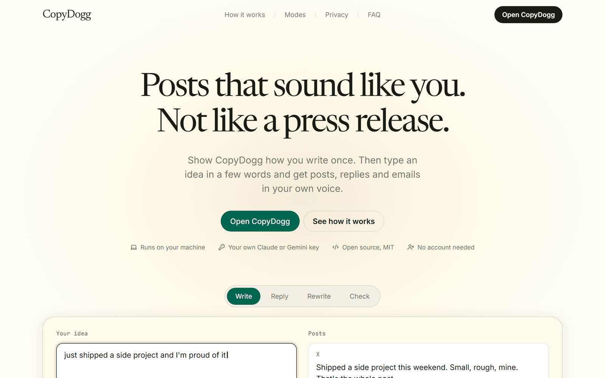
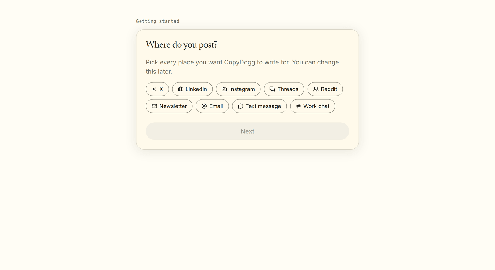
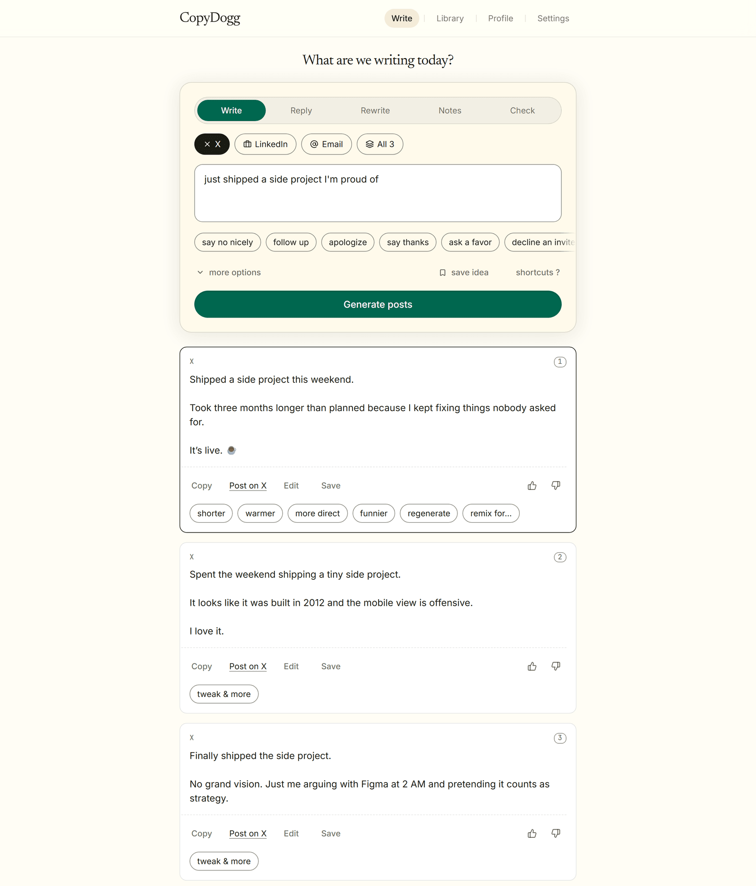
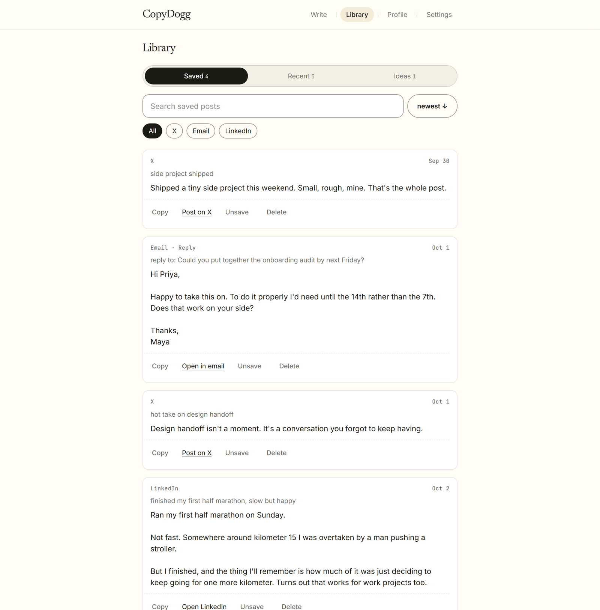
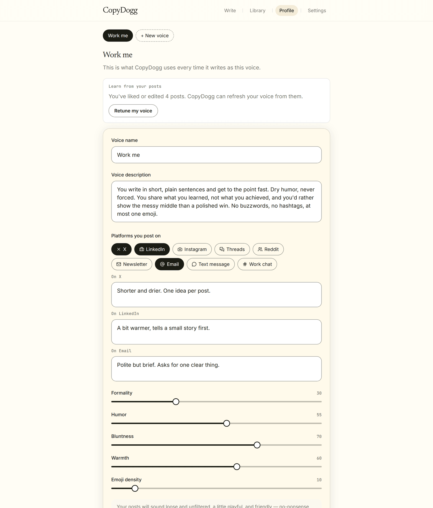
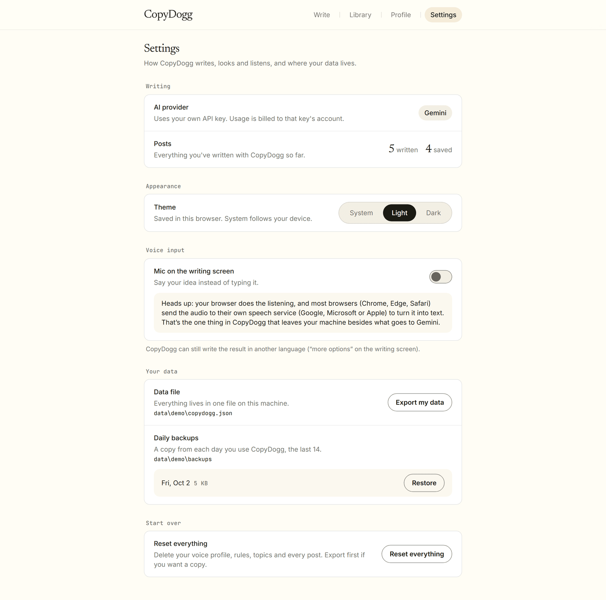

# CopyDogg

CopyDogg is an open-source writing tool that learns how you write. You show it your voice once (the platforms you post on, a few old posts, and one boring post rewritten your way), then type an idea in a few words and get 2–3 posts, replies or emails that already sound like you.

The project is designed to be easy to try first, then connect to a real AI provider later.

## What You Can Do

- Run a working local demo without an API key or any account.
- Teach CopyDogg your voice in about five minutes.
- Write posts for X, LinkedIn, Instagram, Threads, Reddit and newsletters.
- Reply to messages and emails, rewrite rough drafts, and turn meeting notes into a recap, all in your own voice.
- Check how a message will come across before you send it.
- Keep more than one voice ("Work me", "Friends me"), each with its own tone and platforms.
- Save posts to a searchable library, export your data, or restore a daily backup.
- Connect Claude or Gemini for real posts, using your own API key.

## Who This README Is For

This guide is written for non-technical users too. If you can install an app and copy-paste commands, you can run the demo.

If you get stuck, check [SETUP.md](./docs/SETUP.md). It has slower step-by-step instructions and troubleshooting.

## Setup Option 1: Quick Demo

Use this if you only want to see CopyDogg working on your laptop.

### Step 1: Install Node.js

Install Node.js from:

```text
https://nodejs.org
```

Choose the LTS version if you are unsure. CopyDogg needs version 20.9 or newer.

### Step 2: Get The Project

```bash
git clone https://github.com/dhrma-tech/CopyDogg.git
cd CopyDogg
```

Or download the ZIP from GitHub (**Code → Download ZIP**) and unzip it.

### Step 3: Open The Project Folder

Open a terminal in the project folder.

On Windows, you can open the folder, click the address bar, type `powershell`, and press Enter.

### Step 4: Install The App

```bash
npm install
```

### Step 5: Start The App

```bash
npm run dev
```

### Step 6: Open The Website

Open this address in your browser:

```text
http://localhost:3000
```

## Demo Mode

With no API key set, CopyDogg runs in **demo mode**. Every screen works and saves normally; only the AI is replaced with placeholder text.

| Screen | Address | Works in Demo Mode |
|---|---|---|
| Voice setup | `/onboarding` | ✅ Fills in a placeholder voice profile |
| Writing screen | `/app` | ✅ Returns placeholder posts |
| Library | `/app/library` | ✅ Fully |
| Profile | `/app/profile` | ✅ Fully |
| Settings | `/app/settings` | ✅ Fully |

Demo data is saved to `data/copydogg.json` on your computer. It's safe for testing; add a key when you want real posts.

## Setup Option 2: Connect An AI Provider

Use this when you want CopyDogg to actually write in your voice.

Short version:

1. Get an API key: [Claude](https://platform.claude.com/settings/keys) (paid API credit) or [Gemini](https://aistudio.google.com/apikey) (has a free tier).
2. Copy `.env.example` to `.env.local`.
3. Paste your key into `ANTHROPIC_API_KEY` or `GEMINI_API_KEY` in `.env.local`.
4. Save the file.
5. Restart the app (`npm run dev`).

Settings shows which provider is writing your posts. Detailed instructions are in [SETUP.md](./docs/SETUP.md).

## Features

- Voice profile from your own posts, with tone dials, hard rules and per-platform notes
- Five modes: Write, Reply, Rewrite, Notes and Check (tone check)
- Formats for X, LinkedIn, Instagram, Threads, Reddit, newsletters, email, text messages and work chat
- Threads and Instagram carousels
- Quick tweaks: shorter, warmer, more direct, funnier, regenerate, remix for another platform
- Multiple voices, contacts ("write to my boss"), templates, snippets and a words list
- Saved-post library with search
- Optional voice input (off by default)
- Light and dark mode
- Daily backups, data export and reset
- Installable as its own app window, plus an optional browser side-panel extension
- Demo mode for easy local testing

## Product Preview

### Landing Page



### Voice Setup



### Writing Screen



### Library



### Voice Profile



### Settings



## How It Works

1. You pick the platforms you post on and paste a few of your posts.
2. You rewrite one deliberately bland post your way.
3. The AI reads those samples and drafts your voice profile: tone dials, hard rules and per-platform notes.
4. You tweak the profile until it feels right.
5. On the writing screen, you pick a platform and type an idea in a few words.
6. CopyDogg builds a prompt from your voice profile plus your idea, and streams 2–3 versions back.
7. Posts you like, edit or save teach it more about your voice over time.

## Tech Stack

- Next.js 16 (App Router)
- React
- TypeScript
- Tailwind CSS v4
- Claude API via the official `@anthropic-ai/sdk`, or Gemini via its REST API
- No database: one JSON file, read and written through `lib/store.ts`

## Common Commands

```bash
npm install
npm run dev
npm run lint
npx tsc --noEmit
npm run build
npm start
```

## Environment Variables

Create `.env.local` only when connecting an AI provider.

```bash
copy .env.example .env.local
```

On macOS/Linux:

```bash
cp .env.example .env.local
```

| Variable | Required | What It Does |
|---|---|---|
| `ANTHROPIC_API_KEY` | One key for real posts | Your Claude API key. Usage is billed to your Anthropic account. |
| `GEMINI_API_KEY` | One key for real posts | Your Gemini API key from Google AI Studio. Leave both keys empty for demo mode. |
| `AI_PROVIDER` | No | `claude` or `gemini`. Only needed when both keys are set; Claude wins otherwise. |
| `GEMINI_MODEL` | No | Gemini model name. Defaults to `gemini-flash-latest`. |
| `COPYDOGG_PASSWORD` | No | Asks for this password once per device. Set it if anyone else can reach your copy. |
| `COPYDOGG_TRUST_PROXY` | No | Set to `1` only behind a reverse proxy you control, so rate limits use the real client IP. |
| `COPYDOGG_DATA_DIR` | No | Where the data file lives. Defaults to `./data`. |
| `COPYDOGG_SITE_ONLY` | No | Public intro website only: serves the landing page alone. **Never set it on a copy you use.** |

Restart the app after changing any of these. See [.env.example](.env.example) for the full list.

## Project Status

**Current Status: Personal Tool, Stable For Single-User Use**

CopyDogg is in active development and currently suitable for:
- Running your own copy on your laptop
- Running it on a home server or VPS you control (with a password)
- Personal, single-user writing
- Contributing to open-source development

**Not suitable for:**
- Multiple users or teams: there is one data file per install, with no accounts
- Serverless hosts (Vercel, Netlify Functions): their filesystem resets, so your data would disappear
- Hosting for other people on your API key

See [ROADMAP.md](./docs/ROADMAP.md) for what's planned next.

## Known Limitations

- **Testing**: No automated test suite yet; changes are checked by hand, type-checking and linting
- **Rate Limiting**: In-memory and per process; resets on restart
- **Prompt Injection**: Pasted text is fenced as content, but that isn't a hard guarantee
- **Single User**: One data file, no accounts or user separation
- **Voice Input**: Depends on the browser's speech recognition; Firefox doesn't support it
- **Offline Support**: No offline functionality; it needs the local server running
- **Hosting**: Needs a persistent disk, so serverless hosts can only run the landing page

## Security Model Summary

CopyDogg uses a small, layered security approach suited to a single-user tool:

- **Localhost Only by Default**: The app refuses requests from other host names unless a password is set
- **Cross-Site Write Protection**: Writes from other websites are rejected
- **Optional Password Gate**: Signed, expiring cookie with a scrypt-stretched key
- **Rate Limiting**: On unlocking and on every route that calls the AI
- **Server-Side API Keys**: Keys are read only on the server, never sent to the browser

**Critical Security Requirements:**
- Never commit `.env.local` or the `data/` folder
- Never prefix an API key with `NEXT_PUBLIC_`
- Set `COPYDOGG_PASSWORD` and use HTTPS before exposing your copy beyond `localhost`
- Use an API key with a spending limit

See [SECURITY.md](.github/SECURITY.md) for complete security documentation.

## Privacy and Your Data

🔒 **Your Writing Stays on Your Machine**

CopyDogg stores everything in one file on your computer, including:
- Your voice profile, tone dials and rules
- Every post you've generated, edited or saved
- Your contacts, templates, snippets and ideas

**What leaves your machine:**
- The prompt sent to your AI provider (Claude or Gemini): your voice profile, your idea or pasted text, and a few posts you liked
- Your voice, only if you turn on voice input: your browser's speech service hears what you dictate
- Nothing else: no analytics, telemetry or crash reporting

See [docs/PRIVACY.md](./docs/PRIVACY.md) for detailed privacy information.

## Testing

**Current Testing Status: Manual**

The project currently has:
- Type-checking and linting on every pull request (GitHub Actions)
- A production build check in CI
- Manual testing procedures (see [CONTRIBUTING.md](.github/CONTRIBUTING.md#testing-guidelines))
- No automated test suite (planned)

**Planned Testing Improvements:**
- Unit tests for prompt building and data normalization
- API route tests for generation and voice setup
- Security tests for the localhost check and password gate
- End-to-end tests for setup and writing

See [CONTRIBUTING.md](.github/CONTRIBUTING.md) for testing guidelines.

## Folder Structure

```
CopyDogg/
├── app/                     # Next.js pages and API routes
│   ├── api/                 # Server routes (generate, voice setup, tone check, export)
│   ├── app/                 # The main app: writing screen, library, profile, settings
│   ├── onboarding/          # First-run voice setup
│   ├── unlock/              # Password gate screen
│   └── page.tsx             # Landing page
├── components/              # Reusable UI components and the landing page
│   └── ui/                  # Design-system primitives (Button, Card, Field...)
├── lib/                     # Server logic
│   ├── claude.ts            # Builds every prompt
│   ├── llm.ts               # Sends prompts to Claude or Gemini
│   └── store.ts             # The JSON data file
├── docs/                    # Setup guide, roadmap, privacy, checklists, design system, screenshots
├── extension/               # Optional browser side-panel extension
├── public/                  # Static files (signature, intro video)
├── .github/                 # Contributing, security, code of conduct, CI, templates
├── proxy.ts                 # Request checks: localhost, password gate, website mode
├── README.md / LICENSE
└── CLAUDE.md                # Project rules for AI coding assistants
```

## Important Notice Before Exposing It

Before making your copy reachable from anywhere other than `localhost`, review:

- `COPYDOGG_PASSWORD` is set to a strong password
- It's served over HTTPS
- Your API key has a spending limit
- `COPYDOGG_DATA_DIR` points to a disk you back up
- It's not on a serverless host

Read [SECURITY.md](.github/SECURITY.md) and [PRODUCTION_CHECKLIST.md](./docs/PRODUCTION_CHECKLIST.md) first.

## Project Files To Know

| File/Folder | Purpose |
|---|---|
| `app` | Website pages and API routes |
| `components` | Reusable UI components |
| `lib/claude.ts` | The one place prompts are built |
| `lib/llm.ts` | Sends prompts to Claude or Gemini |
| `lib/store.ts` | The JSON data file: the single source of truth for your data |
| `docs/design-system.md` | Colors, type and components: the source of truth for every style |
| `docs/product-plan.md` | The full feature spec |
| `.env.example` | Environment variable template |
| `docs/SETUP.md` | Detailed setup guide |
| `.github/SECURITY.md` | Security notes |
| `.github/CONTRIBUTING.md` | How to contribute |

## Contributing

Contributions are welcome. Please read [CONTRIBUTING.md](.github/CONTRIBUTING.md).

> **⚠️ SELF-HOSTED, SINGLE-USER TOOL**
>
> CopyDogg is built for **one person running their own copy**. It has no accounts and no user separation, so **don't host it for other people**, and don't expose your copy beyond `localhost` without a password and HTTPS.
>
> Anyone who can reach an unprotected copy can generate posts on your API key and read your saved posts.
>
> **Required reading before exposing your copy:**
> - [SECURITY.md](.github/SECURITY.md) - Security model and requirements
> - [SETUP.md](./docs/SETUP.md) - Complete setup guide
> - [PRODUCTION_CHECKLIST.md](./docs/PRODUCTION_CHECKLIST.md) - Checklist for running it beyond your laptop

## License

MIT License. See [LICENSE](./LICENSE).

## Author

Made by **Dharmaraj Aparadh** ([@dhrma-tech](https://github.com/dhrma-tech)).

<picture>
  <source media="(prefers-color-scheme: dark)" srcset="docs/assets/signature-cream.svg">
  
</picture>
